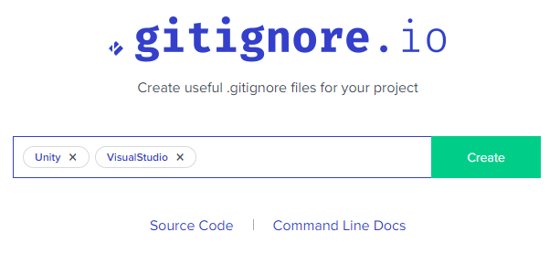
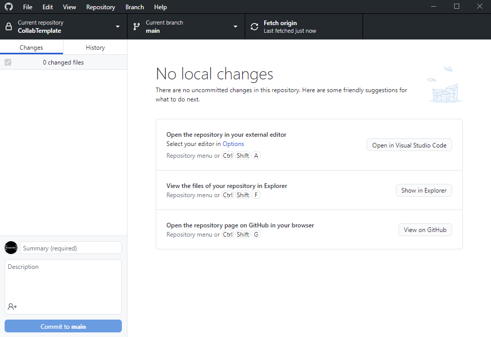

# Collab Template

This template aims to provide the following:

1. A simple Git workflow designed for teams
2. Guidelines for project organization
3. A place to consolidate project resources and documentation

> Note: It is recommended to replace this section with a description about your project.

## Repository Setup

1. First start by pressing the green 'Use this template' button as
   shown below and give your new repo a name. This will create a copy
   of this repo under your control.
   

2. Add your project either directly into the root folder of the repo OR as a subfolder.

3. Add a `.gitignore` file into your project folder. This tells Git to
   ignore certain files and folders in your project. This often is the
   difference between a 1 GB sized repo and a few MB sized repo.

   This website can help you generate a suitable `.gitignore` for your project: https://www.toptal.com/developers/gitignore

   

4. Read through the remainder of this README.

> Note: Remove this section when done

## Resources

If you are ever stuck, don't hesitate a teammate! In addition, here are some important links related to the project.

1. [Placeholder](#) - Put your own links here!

## Workflow Overview

To put it simply, the overall workflow is to:

1. Clone the repo
2. Create a development branch
3. Make and commit your changes
4. Open a pull request
5. Switch back to `main` branch
6. Fetch/Pull any new changes
7. (Optional) Delete your previous local dev branch
8. Create a new dev branch with a new name (`dev/exanite2`, etc) // Todo Can also update branch by merging

After you have opened a pull request, an admin will review your changes and merge it into the project.

In the case of merge conflicts or any other issue, they will also work with you to resolve the issues or suggest improvements.

### Additional workflow tips

1. Try to keep your branches and pull requests small! Smaller branches tend to be more focused and easier to merge.
2. 

## Project Organization

[//]: # (Todo Recommend resources for project organization)

Inside the assets folder, there will be 4 primary folders:

| Name                                    | Purpose                                                                                                                                                                               |
|-----------------------------------------|---------------------------------------------------------------------------------------------------------------------------------------------------------------------------------------|
| [Project](Assets/Project)               | Stores any project related assets that isn't code. This includes art, music, prefabs, shaders, and much more.                                                                         |
| [Project.Source](Assets/Project.Source) | Stores any project related code. This is where programmers will work.                                                                                                                 |
| [Prototype](Assets/Prototype)           | Contains folders related to each developer's ongoing work. Each developer will have their own folder where they can store anything that isn't ready to be included in the final game. |
| [Plugins](Assets/Plugins)               | Stores 3rd party assets and code (unless the asset needs to be in a specific folder).                                                                                                 |

Organization within the Project and Project.Source folder is up to the respective teams and developers working in it.

There is also an additional README file in each primary folder for more information.

## Quick Github Desktop Guide

This guide will use Github Desktop, but any Git client can be used (e.g., Git command line, Sourcetree, etc).

### 💾 Committing
A commit is a group of related changes: `"Add main menu button"` or `"Fix enemy getting stuck on wall"`.

In Github Desktop, commiting takes place on the left side of the window.
Here you can select which files to commit and give your changes a title and description.

> Clicking commit will save your changes into Git locally, but a push is required to upload them to the repo on Github.

### ⬇ Fetch/Pull
Normally two separate actions, Github has combined them into one button at *the top of the window*. Pull will download the latest changes to your computer.

### ⬆ Push
After you *commit*, this will upload your changes to the repo on Github. If you have changes to push, *this will replace the Fetch/Pull button*.

### 🌲 Branching
To avoid merge conflicts, *everyone should have their own development
branch*, unless you are working directly with someone else.

This gives you a separate environment where your code won't be
accidentally changed or broken by others.

For example, William (Exanite)'s branch would be named: `dev/exanite` or `dev/william`.
You can also name your branch by feature: `dev/combat` or `dev/level-generation`.
If you are fixing a bug, you can also use the `fix` prefix: `fix/play-button-not-working`.

To create a branch, click on the "Current branch" button and type in your desired branch name.

### ⬅ Merging
Instead of directly merging your changes back to main, we will be using pull requests. Merging will put your code into the main project.

Once you have made a commit, you can create a pull request in Github Desktop by clicking "Create a pull request from your current branch".
This will take you to the Github webpage where you can give your pull request a title and description.

> Once you click "Create pull request", someone will review your code and merge it for you if there aren't any issues.
