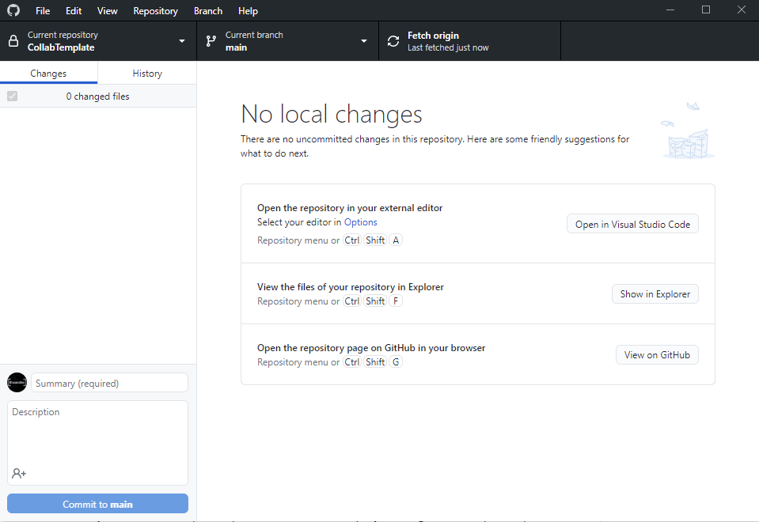

# Contributors

## Workflow Overview

The following is a simple Git workflow meant for larger teams:

[//]: # (Todo)

1. Clone the repo.
2. Create a development branch.
3. Make and commit your changes.
4. Open a pull request.
5. Switch back to `main` branch.
6. Fetch/Pull any new changes.
7. (Optional) Delete your previous local dev branch.
8. Create a new dev branch with a new name (`dev/previous-name-2`, etc).

After you have opened a pull request, a repository maintainer will review your changes and merge it into the project.

In the case of merge conflicts or any other issue, they will also work with you to resolve the issues or suggest improvements.

### Additional Workflow Tips

1. Try to keep your branches and pull requests small! Smaller branches tend to be more focused and easier to merge.
2. Always communicate with your team about what features and files you will be working on.
3. Don't let your branch get outdated. Either update your branch by merging `main` into your branch or create a pull request.

## Quick Github Desktop Guide

This guide will use Github Desktop, but any Git client can be used (e.g., Git command line, Sourcetree, etc).

### 💾 Committing
A commit is a group of related changes: `"Add main menu button"` or `"Fix enemy getting stuck on wall"`.

In Github Desktop, commiting takes place on the left side of the window.
Here you can select which files to commit and give your changes a title and description.

> Clicking commit will save your changes into Git locally, but a push is required to upload them to the repo on Github.

### ⬇ Fetch/Pull
Normally two separate actions, Github has combined them into one button at *the top of the window*. Pull will download the latest changes to your computer.

### ⬆ Push
After you *commit*, this will upload your changes to the repo on Github. If you have changes to push, *this will replace the Fetch/Pull button*.

### 🌲 Branching
To avoid merge conflicts, *everyone should have their own development
branch*, unless you are working directly with someone else.

This gives you a separate environment where your code won't be
accidentally changed or broken by others.

For example, Octocat's branch would be named: `dev/octocat`.
You can also name your branch by feature: `dev/combat` or `dev/level-generation`.
If you are fixing a bug, you can also use the `fix` prefix: `fix/play-button-not-working`.

To create a branch, click on the "Current branch" button and type in your desired branch name.

### ⬅ Merging
Instead of directly merging your changes back to main, we will be using pull requests. Merging will put your code into the main project.

Once you have made a commit, you can create a pull request in Github Desktop by clicking "Create a pull request from your current branch".
This will take you to the Github webpage where you can give your pull request a title and description.

> Once you click "Create pull request", a repository maintainer will review your code and merge it for you if there aren't any issues.