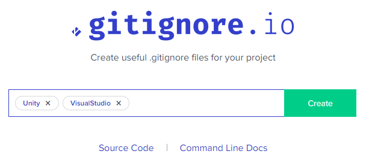

# Repository Maintainers

## Repository Setup

1. First start by pressing the green 'Use this template' button as
   shown below and give your new repo a name. This will create a copy
   of this repo under your control.
   

2. Add your project either directly into the root folder of the repo OR as a subfolder.

3. Add a `.gitignore` file into your project folder. This tells Git to
   ignore certain files and folders in your project. This often is the
   difference between a 1 GB sized repo and a few MB sized repo.

   This website can help you generate a suitable `.gitignore` for your project: https://www.toptal.com/developers/gitignore

   

4. Read through the remainder of this README.

5. (Optional) Add a license to the project (if open source).